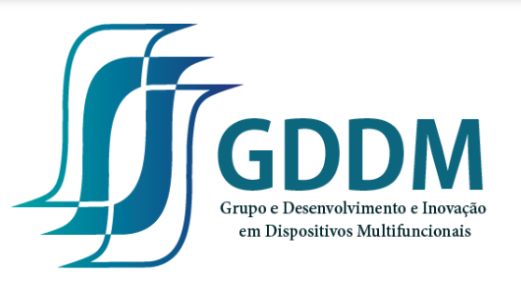

# 🧪 Rede de Materiais

**Plataforma colaborativa de curadoria de materiais e parâmetros de rede**, desenvolvida pelo [GDDM](#sobre-o-gddm) — Grupo de Desenvolvimento e Inovação em Dispositivos Multifuncionais — do Departamento de Física da Universidade Estadual de Maringá (UEM).

🔗 **Acesse a plataforma:** [materiais-uem.streamlit.app](https://materiais-uem.streamlit.app)

---

## O que é

A Rede de Materiais é um banco de dados colaborativo onde professores e pesquisadores cadastram os materiais de sua pesquisa — fórmula química, sistema cristalino, parâmetros de rede, rota de síntese, caracterizações e propriedades físicas — construindo, coletivamente, um acervo consultável e citável da produção do grupo.

Cada pesquisador entra com sua identidade acadêmica (ORCID) e passa a contribuir com seus próprios materiais, ao mesmo tempo em que pode consultar o que já foi cadastrado por todos os colegas — sem duplicar esforço nem perder dado em planilha avulsa.

## Como funciona

**1. Login com ORCID.** Sem senha nova para lembrar — a mesma identidade acadêmica que já identifica o pesquisador em toda a comunidade científica.

**2. Três formas de cadastrar um material:**
- **Manual** — formulário enxuto, com os campos essenciais visíveis e detalhes extras (dopagem, morfologia, propriedades físicas) em seções opcionais.
- **Automática via DOI ou upload de PDF** — cola o DOI ou sobe o artigo, e a IA (Claude, da Anthropic) extrai fórmula, parâmetros de rede e rota de síntese diretamente do texto, pré-preenchendo o formulário para revisão.
- **A partir da própria lista de publicações do ORCID** — o sistema busca os artigos já publicados pelo pesquisador e permite processar cada um com um clique.

**3. Banco colaborativo.** Todo pesquisador autenticado consulta o acervo completo; cada um edita apenas o que é seu, garantido no nível do próprio banco de dados (Row Level Security), não apenas na interface.

## Stack técnica

| Camada | Tecnologia |
|---|---|
| Interface | [Streamlit](https://streamlit.io) |
| Banco de dados e autenticação | [Supabase](https://supabase.com) (PostgreSQL + Auth com provedor OIDC customizado) |
| Identidade acadêmica | [ORCID](https://orcid.org) (OAuth 2.0 / OpenID Connect) |
| Extração de dados de artigos | [Claude](https://www.anthropic.com) (Anthropic API) via tool use estruturado |
| Metadados e acesso aberto | [CrossRef](https://www.crossref.org) e [Unpaywall](https://unpaywall.org) |
| Backup e automação | GitHub Actions (backup semanal para repositório privado dedicado) |
| Hospedagem | Streamlit Community Cloud |

## Sobre o GDDM

O **Grupo de Desenvolvimento e Inovação em Dispositivos Multifuncionais (GDDM)**, do Departamento de Física da Universidade Estadual de Maringá, atua no desenvolvimento e caracterização de materiais funcionais — incluindo cerâmicas multiferróicas, sistemas dopados à base de BiFeO₃ e materiais com aplicações em dispositivos magnetoelétricos, hipertermia magnética e tecnologias correlatas. A pesquisa do grupo combina síntese de materiais, caracterização estrutural (difração de raios X, síncrotron, nêutrons) e modelagem computacional.

*(Espaço reservado para uma descrição mais detalhada do grupo — linhas de pesquisa específicas, membros e projetos em andamento.)*

## Autor / Contato

Prof. Dr. Anuar José Mincache
- Lattes: http://lattes.cnpq.br/9526608938362113
- LinkedIn: https://www.linkedin.com/in/anuar-mincache/
- GitHub: https://github.com/220719
- ORCID: https://orcid.org/0000-0001-8528-8020

## Status

🟢 Em produção — em fase de testes com o grupo de pesquisa.
